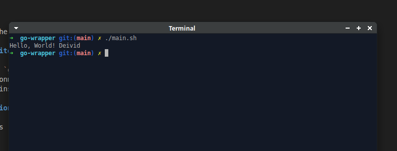

# go-wrapper

A Go Lang wrapper for executing Go code using shell.

## Table of Contents

- [Description](#description)
- [Features](#features)
- [Prerequisites](#prerequisites)
- [Installation](#installation)
- [Print Screen of Usage](#printusage)
- [Usage](#usage)
- [Code for Fun and Learning](#fun)
- [For Educational Use Only](#foreducational)

## Description

The `go-wrapper` is a tool designed to allow users to run Go code snippets through the shell.

## Features

- Utilizes the power of shell for real-time evaluation.

## Prerequisites

Before using `go-wrapper`, ensure that you have the following prerequisites installed:
- A Go environment set up on your system
- /bin/bash installed

## Installation

1. Clone this repository to your web server:
```bash
   git clone https://github.com/deividgermano/go-wrapper.git
   cd go-wrapper
   mv go-wrapper /usr/bin
   chmod +x /usr/bin/go-wrapper
   chmod +x main.sh
   ./main.sh
   ```
   
## Print Screen of Usage



## Code for Fun and Learning

This code is designed with a fun and learning mindset. Enjoy experimenting and discovering new things!

## For Educational Use Only

This code is intended for educational purposes and should not be used in production environments.

